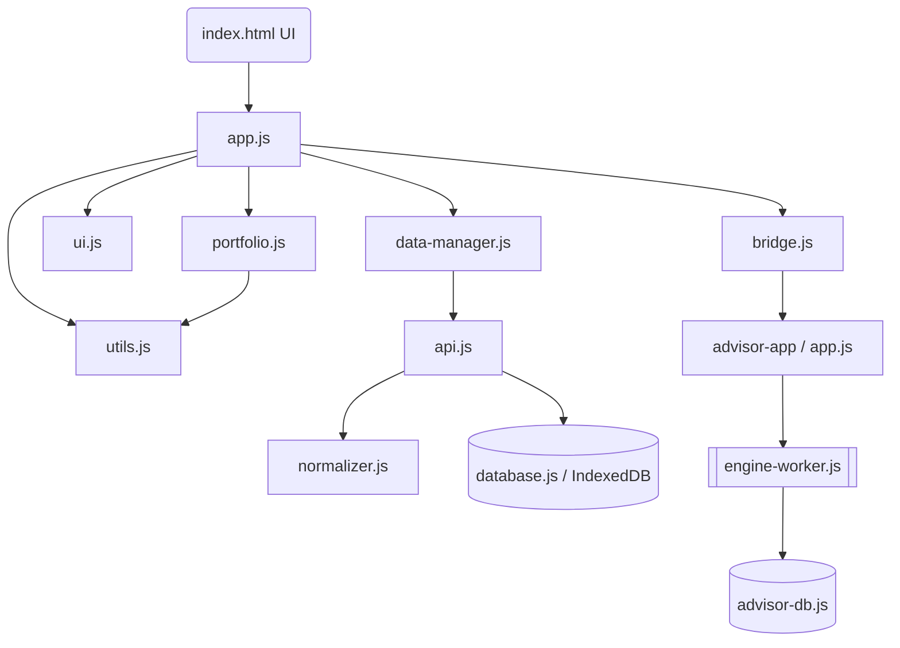

# 📈 MF Insight — Mutual Fund Research App

> 🚀 **Live Demo:** Zero-setup. Open instantly in any modern browser:
> **[https://amank27.github.io/MutualFund-Research-App/](https://amank27.github.io/MutualFund-Research-App/)**

[]()
[]()
[]()
[]()

---

## 🎯 What It Does

**MF Insight** is a personal mutual fund research workbench — a privacy-first, zero-backend tool for Indian investors that runs entirely in your browser. It combines real-time AMFI/MFAPI data with advanced math to surface insights you'd normally need a paid Bloomberg terminal for.

---

## 🏗️ Architecture & Documentation

All deep architectural documentation, feature flow maps, and forensic audits are stored in the `/docs` directory.

- **[System Architecture](docs/SYSTEM_ARCHITECTURE.md)**: Details the SWR caching pattern, StandardFundObject data contract, and component structure.
- **[Feature Flow Map](docs/FEATURE_FLOW_MAP.md)**: End-to-end execution paths for all app features.
- **[Project Full Audit](docs/PROJECT_FULL_AUDIT.md)**: A comprehensive forensic review of bugs, security risks, and optimization targets.

---

## 📜 JavaScript Modules & Use Cases

The application is structured into targeted, specialized modules to separate concerns and manage complexity:

| Script | Responsibility / Use Case |
|--------|---------------------------|
| **`js/database.js`** | IndexedDB wrapper (`MFAppDB`). Persists cache data to prevent rate-limiting and enable offline operation. |
| **`js/normalizer.js`** | Anti-Corruption Layer (ACL). Transforms unstable external JSON structures from `mfapi.in` and `groww.in` into the reliable `StandardFundObject`. |
| **`js/api.js`** | Network layer. Executes `fetch()` requests and handles caching logic. Responsible for fetching NAV histories, peer categories, and holdings via CORS proxies. |
| **`js/data-manager.js`** | Orchestrates background synchronization using a Stale-While-Revalidate (SWR) pattern. Refreshes stale data without blocking the UI. |
| **`js/utils.js`** | Pure mathematical core. Calculates CAGR, Volatility, standard deviations, moving averages, and generates expanded SIP cash flow ledgers. |
| **`js/portfolio.js`** | Manages user holdings, aggregates transactions (Lump Sum/SIP), calculates portfolio XIRR using Newton-Raphson, and categorizes capital gains (STCG/LTCG). |
| **`js/ui.js`** | Pure DOM manipulation, event listener binding, and alert/modal rendering. Translates state changes into HTML updates. |
| **`js/app.js`** | The main application orchestrator. Initializes the app, handles Firebase mock authentication, renders Chart.js elements, and dictates the core app state machine. |
| **`js/bridge.js`** | Navigational interop layer. Verifies session state and safely routes users between the main app and the standalone `advisor-app`. |
| **`js/dev-diagnostics.js`** | Localhost-only script that visually flags basic health anomalies (missing APIs, missing DB indices). |
| **`advisor-app/js/engine-worker.js`** | A dedicated Web Worker for the Robo-Advisor. Runs heavy risk-scoring and peer-filtering algorithms off the main thread to keep the UI fluid. |

---

## 🕸️ Module Dependency Chart



---

## 🏛️ Architectural Evolutions

1. **v1.0.0 (Monolith)**: The initial build. A massive standalone `app.js` directly executed DOM manipulation, fetch requests, and math operations. Data was completely un-cached.
2. **v1.2.0 (Peer Ranking)**: Added advanced categorization logic. This created the first major performance bottleneck, proving the need for a persistence layer.
3. **v1.5.0 (Loss Advisor & Web Workers)**: The Robo-Advisor micro-app was born. It introduced Web Workers `engine-worker.js` to handle intense risk-scoring loops without freezing the main application thread.
4. **v1.6.0 (Modular Extraction)**: Began carving the monolith. `api.js`, `utils.js`, `ui.js`, and `cache.js` were split into their own domains.
5. **v1.6.3 (Strict Segregation & Contract Enforcement)**: Codebase fully segregated by structural purpose (docs, data, frontend assets). The `StandardFundObject` schema was enforced across all modules, and deep forensic auditing paved the foundation for long-term scalability.

---

## 🚀 Running Locally

The app runs on any static file server. A simple Python server is recommended:

```bash
cd "MutualFund Research App"
python3 -m http.server 8082
```

Navigate to `http://localhost:8082`.
*Note: Due to CORS, some remote APIs may require a localhost bypass or proxy when developing locally.*

---

## 📦 Tech Stack

- **Core**: HTML5, Vanilla CSS (Variables, Glassmorphism), Vanilla ES6+ JavaScript.
- **Charts**: Chart.js v4.4.1 + `chartjs-adapter-date-fns`.
- **Storage/Persistence**: Firebase Firestore (user mock/real), IndexedDB `LocalForage` style (caching).
- **Data Providers**: `mfapi.in` (official wrapper), AMFI master CSV, Groww public REST.
- **CI/CD Pipeline**: GitHub Actions (deploy to Pages).

---

## 📄 License & Restrictions

Private repository. All intellectual and structural rights reserved.
Do not clone, distribute, or deploy without explicit authorization.
