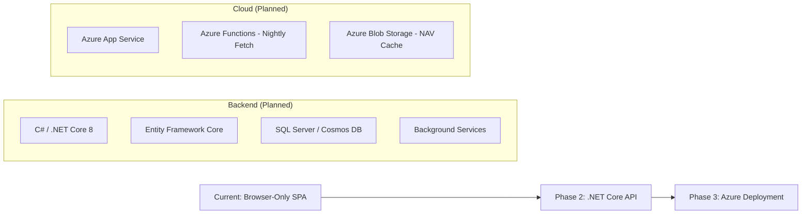

# 📈 MutualFund Research App

> A bespoke, zero-backend financial tool for tracking stable hybrid and equity mutual funds — with advanced metrics like CAGR, Volatility, and Sharpe Ratios, all running locally in your browser.

[]()
[]()
[]()

---

## 🎯 Project Vision

This application is designed to be a **personal mutual fund research workbench** — a powerful, fast, and privacy-first tool that lets you:

- 🔍 **Search** any Indian mutual fund by AMFI scheme code
- 📊 **Analyse** performance with CAGR (1Y/3Y/5Y/Max), Volatility (σ), and Sharpe Ratios
- 📈 **Visualise** NAV history with interactive, zoomable charts
- 📋 **Compare** funds in sortable tables across 15 subcategories
- 🔖 **Track** your favourites with a persistent watchlist

No accounts, no servers, no tracking — just pure financial data running in your browser.

---

## 🏗️ Current Architecture (MVP)

```
┌──────────────────────────────────────────────────┐
│                   Browser (Client)                │
│                                                    │
│  ┌────────────┐  ┌───────────┐  ┌──────────────┐ │
│  │  index.html │  │  Chart.js  │  │ localStorage │ │
│  │  (SPA)      │  │  (CDN)     │  │ (Watchlist)  │ │
│  └──────┬─────┘  └─────┬─────┘  └──────────────┘ │
│         │              │                           │
│         └──────┬───────┘                           │
│                ▼                                    │
│      fetch('api.mfapi.in/mf/{code}')              │
└──────────────────────────────────────────────────┘
                     │
                     ▼
          ┌─────────────────────┐
          │  mfapi.in (Public)  │
          │  Free NAV History   │
          └─────────────────────┘
```

| Layer | Technology |
|-------|-----------|
| **Structure** | HTML5, Semantic elements |
| **Styling** | Vanilla CSS, CSS Variables, Glassmorphism |
| **Logic** | Vanilla JavaScript (ES6+) |
| **Charts** | Chart.js v4.4.1 + date-fns adapter |
| **Data API** | [mfapi.in](https://www.mfapi.in/) (free, public, no key required) |
| **State** | Browser `localStorage` |
| **Typography** | Google Fonts (Inter) |

**Single-file architecture**: Everything lives in one `index.html` file (~2000 lines) for maximum portability.

---

## 🔮 Future Tech Stack Migration

The MVP validates the UX and calculations. The production roadmap involves migrating to a high-performance backend:



| Component | Current (MVP) | Planned (v2.0) |
|-----------|--------------|-----------------|
| **Frontend** | Single HTML file | React / Blazor WASM |
| **Backend** | None | C# .NET Core 8 Microservices |
| **Database** | localStorage | Entity Framework + SQL Server |
| **Data Fetch** | Client-side `fetch()` | Azure Functions (nightly cron) |
| **Hosting** | Local file / HTTP server | Azure App Service |
| **Auth** | None | Azure AD B2C |
| **Caching** | None | Redis + Azure Blob Storage |

### Why C# / .NET Core?
- **Type safety** for financial calculations
- **Entity Framework** for clean data modelling of NAV history
- **Background Services** for automated nightly API ingestion
- **Azure-native** deployment with managed scaling

---

## 🚀 Quick Access — Run Locally

### Option 1: Direct File Open (Simplest)
```
Right-click  index.html  →  Open With  →  Google Chrome / Edge / Firefox
```
> ⚠️ **Note:** Some browsers block `fetch()` from `file://` URLs due to CORS. If search doesn't work, use Option 2.

### Option 2: Local HTTP Server (Recommended)
```bash
# Navigate to the project folder
cd "/path/to/MutualFund Research App"

# Start a simple Python server
python3 -m http.server 8765

# Open in browser
open http://localhost:8765
```

### Option 3: VS Code Live Server
1. Install the [Live Server](https://marketplace.visualstudio.com/items?itemName=ritwickdey.LiveServer) extension
2. Right-click `index.html` → **Open with Live Server**

> 📌 **Private Repo Note:** Since this is a private GitHub repository, standard GitHub Pages deployment is not available without GitHub Pro or workarounds like GitHub Actions + Cloudflare Pages.

---

## 📂 Project Structure

```
MutualFund Research App/
├── index.html          # Main application (SPA)
├── README.md           # This file
└── changelog/
    └── v1.0.0.md       # Initial release notes
```

---

## 📋 Features

### Fund Research
- Search by AMFI scheme code
- Live NAV data from mfapi.in
- CAGR calculation (1Y, 3Y, 5Y, Max)
- Annualised volatility (Standard Deviation)
- Interactive Chart.js NAV history chart with range toggles

### Category Browser
- 4 fund categories: Hybrid, Equity, Debt, Passives
- 15 subcategories with mock performance data
- 7-column sortable data table
- Color-coded risk/return metrics
- Click-to-drill-down into any fund

### Watchlist
- Add/remove funds
- Persists across browser sessions via localStorage
- Quick-load saved funds

---

## 📝 Changelog

See the [`changelog/`](changelog/) directory for detailed version history.

- **[v1.0.0](changelog/v1.0.0.md)** — Initial release: full SPA with search, charts, categories, data tables, and 8 bug fixes

---

## 📄 License

Private repository. All rights reserved.
